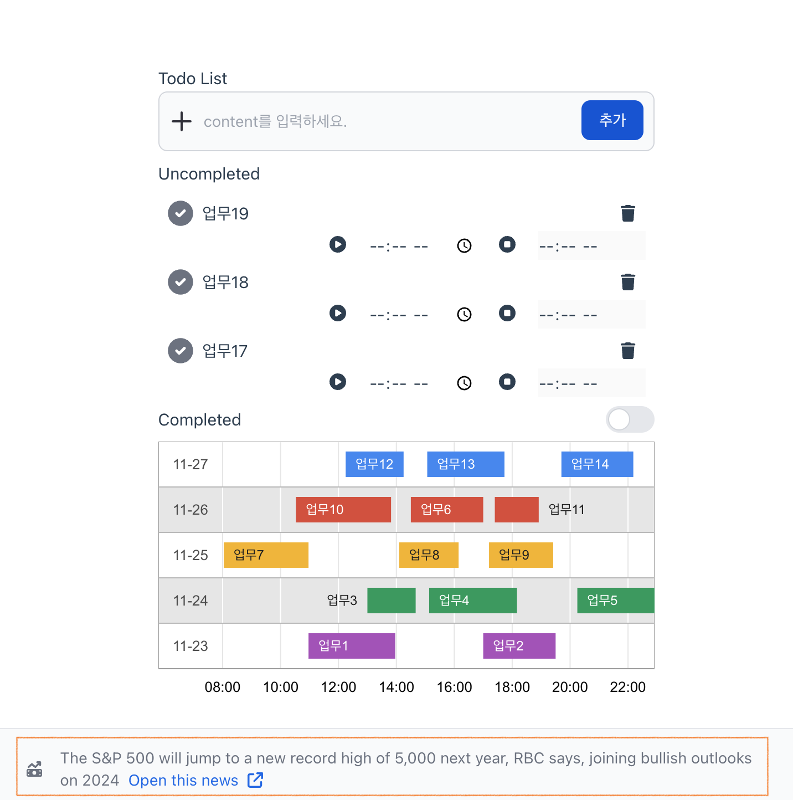
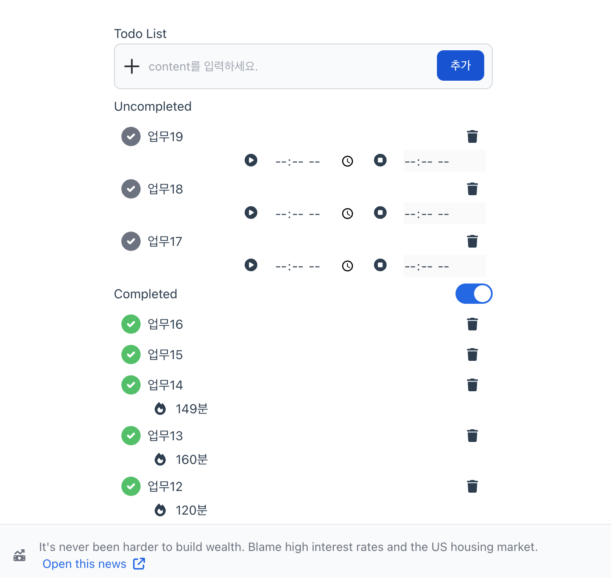

# What2do
## 프로젝트 설명
- 😵 단순한 투두리스트가 아닙니다.
- ⌛️ 한 업무를 진행할 때, **시작시간과 끝시간을 함께 기록**하여 업무에 더욱 집중할 수 있습니다.
- 📊 업무에 대한 타임라인을 보여줍니다. 
- 🥥 간편한 Kakao Oauth2 가입만으로 사용할 수 있습니다.

### 프로젝트를 시작한 이유
- 🗓 저는 시간을 가장 중요하게 생각합니다. todo 리스트를 채우는 것만으로는 시간관리를 어떻게 했는지 알 수 없다는 것이 아쉬웠습니다.
- 🛢 각각의 태스크를 연속적으로 시각화할 수 있다면, 나의 하루를 데이터화하여 측정할 수 있을 것이라고 생각했습니다.
- 🏃🏻‍♂️ 그렇기 때문에! 이 프로젝트는 아직 가야할 길이 멀다고 느낍니다. 아래 개발 예정 항목들을 꾸준히 개발해 나가겠습니다.

### 서비스 데모
```plain
테스트 아이디: test@gmail.com
테스트 비밀번호: 5933
```

#### 데모 이미지
<div style="display: flex; justify-content: space-between;">
  
  
</div>
<br/>

- 주황박스가 있는 항목은 크롤링을 통해 얻은 미국 주식 뉴스에 대한 내용을 특정 시간 간격으로 보여줍니다.
- 일반적인 todo 리스트와 같이 항목을 추가하면 역순으로 등록이 됩니다.
- todo를 등록하고 재생버튼을 누르면 시작 시간이, 정지버튼을 누르면 업무를 마친 시간이 등록됩니다.
- 실행잉 완료되지 않은 항목은 Uncompleted 목록에, 실행을 마친 항목은 체크하면 Completed 목록으로 배치됩니다.
- toggle 버튼을 통해 완료 항목을 상세히 볼 수 있으며, 각 항목을 수행하는데 걸린 시간이 표시됩니다.
- 완료 항목에 대한 타임라인은 호버를 통해 각각의 업무를 수행하는데 걸린 시간을 볼 수 있습니다.

#### 데모사이트: [간단한 가입과 함께 What2Do 사용해보세요!](http://www.devyam.net:3000/)

### 서비스 실행 방법
```shell
# 추후 작성 예정입니다.
```

### 기술 설명
- vue를 frontend, fastapi를 backend로 구축하였습니다.
- sqlite3를 사용하여 빠르게 3-tier 서버 아키텍처를 구성하였습니다.
- 프로젝트를 Docker container로 구성하여 Docker compose를 사용한 빠른 배포환경을 설정하였습니다.
- google chart를 사용하여 하루 수행한 투두 리스트를 시간순서로 나열합니다.

### 크롤링 기능
- 크롤링 관련 기능에 대한 내용은 [여기](./mysite/project/apps/news/)에서 보실 수 있습니다.
- [yahoo! finance](https://finance.yahoo.com/news/) 페이지를 기반으로 크롤링 작업을 진행 중에 있습니다.

### 앞으로 구현해나갈 항목
- [ ] papago 번역 API를 사용해서 미국 뉴스 크롤링, 번역 이후 저장하도록
- [ ] 단위 테스트 및 API 테스트 항목들 꾸준히 추가해 나가기
- [ ] 뉴스 크롤링 배치 서버 실행
- [ ] DB -> RDS를 사용하는 방식으로 변경하고 서버에서 환경 추가하기
- [ ] ECS로 배포하는 작업 수행
- [ ] github action을 활용한 CI/CD 구축